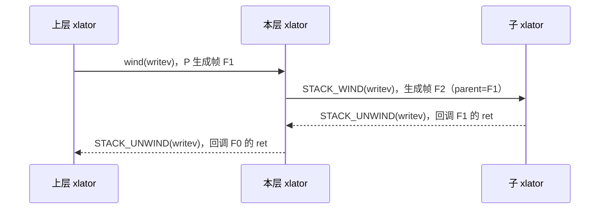

# 调用栈与 FOP 模型

GlusterFS 内部不存在「一次调用走完整条链路再返回」的函数调用栈。一次文件操作进入
graph 后，每一层 xlator 都会为它创建一个新的执行上下文（调用帧），把请求交给下级后
立即返回，直到最终结果沿原路逐层回调上来。理解这套上下文与传递宏，是读懂任何 xlator
代码的前提。FOP 的集合定义见 [术语表](../overview/glossary.md#请求处理)，xlator 的
注册方式见 [xlator 框架](xlator-framework.md)。

## 目录

- 三个核心对象
- 请求向下：STACK_WIND
- 应答向上：STACK_UNWIND
- 未实现 FOP 的默认路径与恢复
- FOP 集合与优先级
- 回调之外的两类操作
- 同步化写法
- 一个请求的帧演进
- 代码位置

## 三个核心对象

| 对象 | 类型 | 生命周期 | 含义 |
| --- | --- | --- | --- |
| 调用栈 | `call_stack_t`（`libglusterfs/src/glusterfs/stack.h:87`） | 从请求进入 graph 到结果返回 | 承载一次完整请求，保存发起者身份、操作类型、锁所有者等全局信息 |
| 调用帧 | `call_frame_t`（`libglusterfs/src/glusterfs/stack.h:58`） | 一层 xlator 的处理过程 | 一层内的上下文，指向所属调用栈、父帧、本层 xlator 与私有数据 |
| 调用桩 | `call_stub_t`（`libglusterfs/src/glusterfs/call-stub.h:137`） | 由使用方显式创建与释放 | 把「一次待发起的调用」冻结成对象，供稍后恢复 |

`call_frame_t` 中与阅读代码关系最大的字段：

| 字段 | 用途 |
| --- | --- |
| `root` | 指向所属 `call_stack_t`，跨层传递的公共信息从这里取 |
| `parent` | 上一层的帧，unwind 时向它回调 |
| `this` | 当前帧所处的 xlator，即代码里的 `THIS` |
| `local` | 本层私有数据，通常由本层在 wind 前分配、在回调中释放 |
| `cookie` | 一次 wind 的标识，用于在同一层的多个并发子请求之间区分回应 |
| `ret` | 回调函数地址，由 `STACK_WIND` 的第二个参数决定 |
| `op` | 本次操作的 FOP 编号 |
| `begin`、`end` | 用于延迟统计 |

## 请求向下：STACK_WIND

把请求交给子节点使用 `STACK_WIND`
（`libglusterfs/src/glusterfs/stack.h:283`），展开后由 `STACK_WIND_COMMON`
（`libglusterfs/src/glusterfs/stack.h:295`）实现，它依次完成：

1. 从帧内存池取出一个新的 `call_frame_t`；
2. 新帧的 `root` 指向同一调用栈，`parent` 指向当前帧，`this` 指向目标子 xlator；
3. 新帧的 `ret` 设为本层的回调函数，`cookie` 按需设为传入值或新帧自身；
4. 把新帧挂到调用栈的 `myframes` 链表上，供遍历与诊断；
5. 把 `THIS` 切换到目标 xlator，调用目标 FOP 实现，然后恢复 `THIS`。

三个变体的差别只在于帧的使用方式：

| 宏 | 位置 | 适用场景 |
| --- | --- | --- |
| `STACK_WIND` | `libglusterfs/src/glusterfs/stack.h:283` | 常规调用，回调由框架传入 |
| `STACK_WIND_COOKIE` | `libglusterfs/src/glusterfs/stack.h:287` | 同一层需要发起多个子请求，用 `cookie` 区分 |
| `STACK_WIND_TAIL` | `libglusterfs/src/glusterfs/stack.h:253` | 尾调用，复用当前帧、不新建帧 |

wind 时框架还会做两件事，可解释为什么某些 xlator 会「看不到」请求：一是累加目标
xlator 的 FOP 计数与延迟统计；二是若目标被标记为 `pass_through`，则改调
`pass_through_fops` 表中对应的实现，从而绕过该 xlator 的正常逻辑。

## 应答向上：STACK_UNWIND

返回结果使用 `STACK_UNWIND_STRICT`
（`libglusterfs/src/glusterfs/stack.h:346`），宏参数为
`(fop, frame, op_ret, op_errno, ...)`，末尾参数必须与该 FOP 的回调参数列表一致。宏在
编译期用 `fop_<fop>_cbk_t` 做类型检查，因此参数写错会在编译期暴露。

每一层的 FOP 实现都有一个对应的回调函数，命名与签名由 FOP 决定，例如
`fop_lookup_cbk_t`（`libglusterfs/src/glusterfs/xlator.h:90`）。回调的通用约定是：

| 参数 | 含义 |
| --- | --- |
| `frame` | 本层的帧 |
| `cookie` | wind 时传入的标识，未使用时为 NULL |
| `this` | 本层 xlator |
| `op_ret`、`op_errno` | 结果与错误码，`op_ret < 0` 表示失败 |
| 其余参数 | 该 FOP 的返回值，如 `inode`、`struct iatt`、`dict_t` |

## 未实现 FOP 的默认路径与恢复

未实现的 FOP 由 `fill_defaults`（`libglusterfs/src/xlator.c:81`）填入默认实现，默认
实现把请求原样转发给第一个子节点，并在回调中直接 unwind。除正常实现外，默认实现还提供
一组 `_cbk_resume` 形式的函数（声明见 `libglusterfs/src/glusterfs/defaults.h:552`），
用于在条件满足后重新发起一次之前被挂起的调用。

需要「先处理、后转发」的场景使用调用桩：`call-stub.c` 为每个 FOP 提供
`fop_<name>_stub` 构造函数（例如 `fop_lookup_stub`，
`libglusterfs/src/call-stub.c:36`），把参数与回调冻结成 `call_stub_t`；条件满足后调用
`call_resume`（`libglusterfs/src/call-stub.c:2378`）重新发起，它根据桩的种类分别走
`call_resume_wind`（`libglusterfs/src/call-stub.c:1861`）或
`call_resume_unwind`（`libglusterfs/src/call-stub.c:2130`）。

服务端的典型用法是「先解析路径、再执行 FOP」：收到请求后先把帧挂起，解析出目标
xlator，再恢复执行（`xlators/protocol/server/src/server-rpc-fops_v2.c:4094` 的
`resolve_and_resume`，随后由 `server4_writev_resume`
（`xlators/protocol/server/src/server-rpc-fops_v2.c:3127`）完成 wind）。

## FOP 集合与优先级

FOP 编号集中定义在 `libglusterfs/src/glusterfs/glusterfs-fops.h:16` 的
`enum glusterfs_fop_t`，从 `GF_FOP_STAT` 到 `GF_FOP_COPY_FILE_RANGE` 共 58 项，末尾的
`GF_FOP_MAXVALUE`（`libglusterfs/src/glusterfs/glusterfs-fops.h:76`）用于确定各表的
大小。

其中 `GF_FOP_GETSPEC` 是一个容易被误读的成员：它在枚举中与文件操作并列，但语义上是
获取 volfile。客户端侧它通过 `conf->fops` 的 FOP 分派表处理
（`xlators/protocol/client/src/client.c:2056` 的 `client_getspec`），而在协议层它对应
的是握手过程而不是普通文件操作。

任务调度时使用优先级区分请求类型，取值见 `gf_fop_pri_t`
（`libglusterfs/src/glusterfs/glusterfs.h:399`）：`GF_FOP_PRI_HI`（低延迟）、
`GF_FOP_PRI_NORMAL`、`GF_FOP_PRI_LO`（批量）、`GF_FOP_PRI_LEAST`。

## 回调之外的两类操作

并非所有交互都是「wind 一个 FOP」：

**cbks。** `struct xlator_cbks`（`libglusterfs/src/glusterfs/xlator.h:692`）中的
`forget`、`release`、`releasedir` 表示「对象不再被引用」，只向下传递通知，不产生应答，
用于释放与 inode、fd 绑定的状态。

**notify。** 事件通道，用于传递上下级就绪状态、连接变化等，见
[xlator 框架](xlator-framework.md#生命周期)。

## 同步化写法

直接书写回调式的异步代码可读性差，因此许多逻辑改用同步写法：`synctask` 是一个在等待
FOP 结果时可以让出的轻量执行单元，让出后由事件框架在同一线程池中继续执行其他任务。相关
实现见 `libglusterfs/src/syncop.c`：创建任务用 `synctask_new`
（`libglusterfs/src/syncop.c:604`），让出用 `synctask_yield`
（`libglusterfs/src/syncop.c:263`），唤醒用 `synctask_wake`
（`libglusterfs/src/syncop.c:348`），线程池由 `syncenv_new`
（`libglusterfs/src/syncop.c:858`）创建。

## 一个请求的帧演进

以 `writev` 为例，帧与调用栈的对应关系如下：

同一个调用栈上可以有多个并行的子帧，这正是副本类 xlator 的工作方式：向所有子卷各发一个
写请求，收集齐应答后再向上一级 unwind 一次。

## 代码位置

| 内容 | 位置 |
| --- | --- |
| 帧与栈的结构定义 | `libglusterfs/src/glusterfs/stack.h:58`、`:87` |
| 传递宏 | `libglusterfs/src/glusterfs/stack.h:253`、`:283`、`:346` |
| FOP 编号 | `libglusterfs/src/glusterfs/glusterfs-fops.h:16` |
| 默认实现与恢复函数 | `libglusterfs/src/defaults-tmpl.c`、`libglusterfs/src/glusterfs/defaults.h:552` |
| 调用桩 | `libglusterfs/src/call-stub.c` |
| 参数暂存 | `libglusterfs/src/default-args.c` |

## 相关文档

- [xlator 框架](xlator-framework.md)
- [架构总览](../overview/architecture.md#一次写请求的完整路径)
- [RPC 与传输](rpc-and-transport.md)
