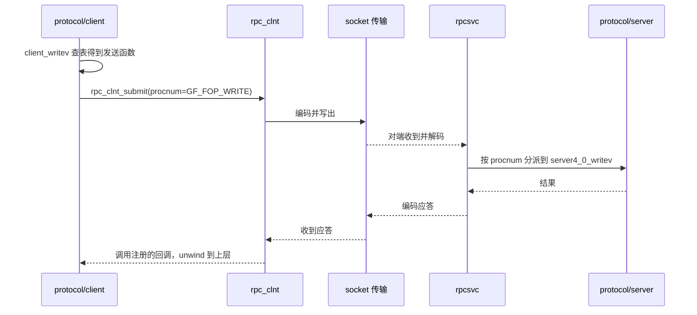

# RPC 与传输

客户端与服务端是两棵独立的 xlator 树，二者之间以及管理与被管理进程之间的跨进程调用全部
由 `rpc/` 提供：服务端框架 `rpcsvc`、客户端框架 `rpc_clnt`、可动态加载的传输层，以及
用 XDR 定义的消息结构。本文说明这三层的分工与一次远程 FOP 的往返过程，其在 translator
框架中的位置见 [xlator 框架](xlator-framework.md)。

## 组成

| 组件 | 位置 | 职责 |
| --- | --- | --- |
| 服务端框架 | `rpc/rpc-lib/src/rpcsvc.c` | 程序注册、请求分派、认证、重复请求缓存 |
| 客户端框架 | `rpc/rpc-lib/src/rpc-clnt.c` | 连接管理、请求排队与超时、回复处理 |
| 传输抽象 | `rpc/rpc-lib/src/rpc-transport.c` | 按配置加载具体传输实现 |
| socket 传输 | `rpc/rpc-transport/socket/src/socket.c` | TCP 与 UNIX 域套接字的收发、保活、连接管理 |
| 重复请求缓存 | `rpc/rpc-lib/src/rpc-drc.c` | 抑制重传导致的重复执行 |
| 认证 | `rpc/rpc-lib/src/auth-*.c` | 空认证、UNIX 认证、gluster 认证 |
| 消息定义 | `rpc/xdr/src/*.x` | RPC 载荷结构，构建期生成对应的 XDR 编解码代码 |

## 服务端：程序与 actor 表

服务端把「一组可被远程调用的过程」组织为程序。结构 `struct rpcsvc_program`
（`rpc/rpc-lib/src/rpcsvc.h:331`）用 `prognum`、`progver` 标识程序与版本，用 `actors`
数组描述每个过程号对应哪个处理函数；数组元素为 `rpcsvc_actor_t`
（`rpc/rpc-lib/src/rpcsvc.h:296`），其中 `procnum` 是过程号，`actor` 是处理函数
（函数类型定义见 `rpc/rpc-lib/src/rpcsvc.h:276`）。

程序表按监听方式分为两组，`glusterd` 的注册就是典型例子：

| 监听方式 | 程序 | 位置 |
| --- | --- | --- |
| 网络 | peer、mgmt、mgmt v3、portmap、handshake、mgmt handshake | `xlators/mgmt/glusterd/src/glusterd.c:76` |
| UNIX 域套接字 | CLI 程序、GETSPEC 程序 | `xlators/mgmt/glusterd/src/glusterd.c:85` |

服务端 graph 侧的过程表把协议过程号映射到具体 FOP 处理函数，例如写操作为
`[GFS3_OP_WRITE]`（`xlators/protocol/server/src/server-rpc-fops_v2.c:6123`），指向
`server4_0_writev`（`xlators/protocol/server/src/server-rpc-fops_v2.c:4040`）。

## 客户端：程序表与提交

客户端侧与之对称：`rpc_clnt_prog_t`（`rpc/rpc-lib/src/rpc-clnt.h:84`）携带
`proctable`，表项为 `rpc_clnt_procedure_t`（`rpc/rpc-lib/src/rpc-clnt.h:75`），每个
过程号对应一个发送函数。会话由 `rpc_clnt_new`（`rpc/rpc-lib/src/rpc-clnt.h:192`）建立，
请求由 `rpc_clnt_submit`（`rpc/rpc-lib/src/rpc-clnt.h:221`）提交。

客户端 graph 中的过程表实例为 `clnt4_0_fop_prog`
（`xlators/protocol/client/src/client-rpc-fops_v2.c:6059`），其分派表把 FOP 编号映射到
具体的发送函数，例如 `[GF_FOP_WRITE]` → `client4_0_writev`
（`xlators/protocol/client/src/client-rpc-fops_v2.c:6013`）。

## 传输层

传输实现是可替换的共享库，加载入口为 `rpc_transport_load`
（`rpc/rpc-lib/src/rpc-transport.c:151`），库路径按
`<RPC_TRANSPORTDIR>/<type>.so` 拼接（`rpc/rpc-lib/src/rpc-transport.c:253`），其中
`RPC_TRANSPORTDIR` 是 `$(libdir)/glusterfs/$(PACKAGE_VERSION)/rpc-transport`
（`rpc/rpc-lib/src/Makefile.am:24`）。

配置中的 `transport-type` 会被归一化：未配置时默认为 `socket`
（`rpc/rpc-lib/src/rpc-transport.c:182`），配置为 `tcp`、`unix` 或 `ib-sdp` 时同样被
改写为 `socket`（`rpc/rpc-lib/src/rpc-transport.c:201`）。因此 volfile 中的
`option transport-type tcp` 实际加载的是 socket 传输，TCP 与 UNIX 域套接字的差别由
`transport.socket.*` 系列选项决定，例如监听方向使用 `transport.socket.listen-port`，
连接方向使用 `transport.socket.connect-path`。

## 消息定义

RPC 载荷结构写在 `rpc/xdr/src/*.x` 中，构建期由 rpcgen 生成编解码代码。与文件操作相关的
定义集中在 `rpc/xdr/src/glusterfs4-xdr.x`，管理类操作的定义在
`rpc/xdr/src/glusterd1-xdr.x`、`rpc/xdr/src/cli1-xdr.x` 等文件中。以 volfile 请求为例，
请求与应答结构为 `gf_getspec_req`、`gf_getspec_rsp`，其编解码函数以 `xdr_` 前缀被直接
引用（`glusterfsd/src/glusterfsd-mgmt.c:2305`）。

## 连接建立与协议版本协商

连接建立后先进行握手，握手过程本身也是一个 RPC 程序。相关过程号定义在
`rpc/rpc-lib/src/protocol-common.h:78`，包括 `GF_HNDSK_SETVOLUME`、`GF_HNDSK_GETSPEC`、
`GF_HNDSK_PING` 等。

握手的实际作用是确定双方共同支持的协议版本。客户端拿到服务端支持的程序列表后，在
`xlators/protocol/client/src/client-handshake.c:852` 比较 `prognum` 与 `progver`，选中
匹配的过程表并保存到 `conf->fops`。此后该客户端的每个 FOP 都通过这张表发送，这就是
「同一个 FOP 在不同协议版本下由不同函数处理」的实现方式。

## 一次远程写请求的往返

与本地 FOP 的差别只在于最底层：`protocol/client` 把一次 wind 转换成一次网络提交，并在
收到应答后以同样的方式 unwind，上层 xlator 感知不到跨越了网络。

## 代码位置

| 内容 | 位置 |
| --- | --- |
| 服务端框架 | `rpc/rpc-lib/src/rpcsvc.c`、`rpc/rpc-lib/src/rpcsvc.h` |
| 客户端框架 | `rpc/rpc-lib/src/rpc-clnt.c`、`rpc/rpc-lib/src/rpc-clnt.h` |
| 传输加载 | `rpc/rpc-lib/src/rpc-transport.c:151` |
| socket 实现 | `rpc/rpc-transport/socket/src/socket.c` |
| 消息定义 | `rpc/xdr/src/` |
| 客户端 FOP 分派 | `xlators/protocol/client/src/client-rpc-fops_v2.c:6059` |
| 服务端 FOP 分派 | `xlators/protocol/server/src/server-rpc-fops_v2.c:6123` |

## 相关文档

- [架构总览](../overview/architecture.md)
- [调用栈与 FOP 模型](call-stack-and-fop.md)
- [volfile 与图构建](volfile-and-graph.md)
