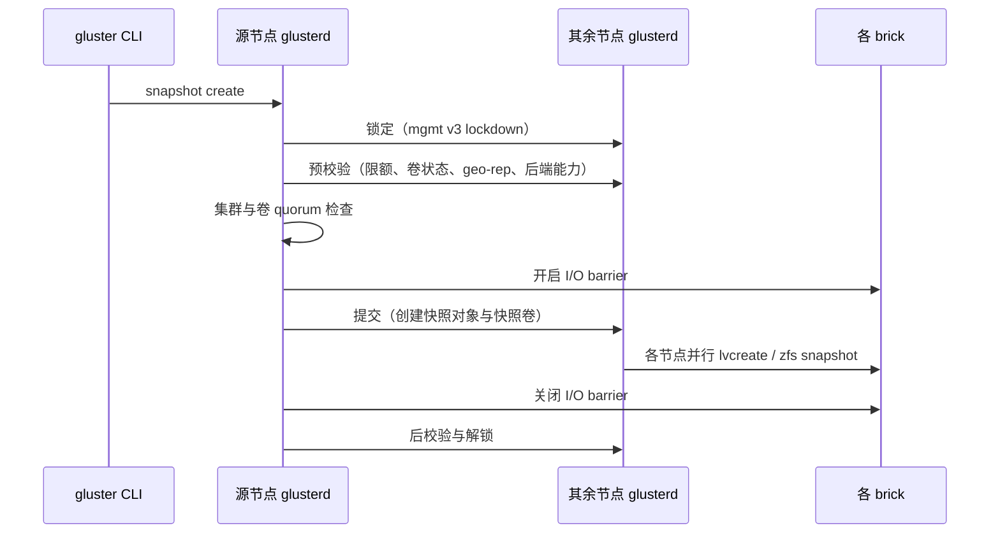

# 快照

GlusterFS 的快照作用于**整个卷**，做法是把每个 brick 所在的后端存储卷在某一时刻做一次
时间点副本（LVM 精简卷快照或 ZFS 快照），再把这批副本组织成一个新的只读卷。快照期间靠
I/O barrier 与 quorum 检查保证副本处于一致状态，快照元数据由 `glusterd` 维护在
`/var/lib/glusterd/snaps/` 下。因此快照不是文件级复制，快照创建的开销与卷的数据量无关，
只与 brick 数量和后端存储能力有关。

## 目录

- 概览
- 涉及模块
- 实现原理
- 端到端流程
- 数据与元数据
- 一致性与异常处理
- 配置与操作
- 限制与影响
- 代码位置

## 概览

快照提供的能力：

| 能力 | 命令 | 说明 |
| --- | --- | --- |
| 创建 | `snapshot create` | 为卷的全部 brick 各做一份后端副本，并生成快照卷 |
| 查看 | `snapshot list`、`snapshot info`、`snapshot status` | 列出快照、查看详情与每个 brick 的状态 |
| 激活 / 去激活 | `snapshot activate`、`snapshot deactivate` | 启动 / 停止快照卷的 brick，并挂载 / 卸载后端副本 |
| 浏览 | 挂载点下的 `.snaps` 目录 | 用户自助访问（USS），只读 |
| 直接挂载 | `glusterfs --volfile-id=/snaps/<snapname>/<volname>` | 把快照卷当普通卷挂载 |
| 克隆 | `snapshot clone` | 由快照生成一个新的可写卷 |
| 恢复 | `snapshot restore` | 用快照内容替换源卷，快照本身随之消失 |
| 删除 | `snapshot delete` | 删除快照及其后端副本 |
| 限额配置 | `snapshot config` | 硬上限、软上限、自动删除、创建即激活 |

快照能成立的前提是 brick 所在文件系统支持时间点副本：精简置备的 LVM 逻辑卷，或 ZFS
dataset。两者都不满足时，`glusterd` 会在探测阶段判定该 brick 不支持快照，创建请求失败。

## 涉及模块

| 模块 | 承担职责 | 文档 |
| --- | --- | --- |
| `glusterd` | 快照对象与元数据、事务编排、后端副本的创建与销毁、恢复与克隆 | 本文 |
| 快照后端插件（LVM / ZFS） | 具体的副本创建、挂载、销毁、路径计算 | 本文 |
| `features/snapview-server` | 用户自助访问的服务端：把快照卷内容以只读方式暴露给挂载点 | [snapview-server](../modules/snapview-server.md) |
| `features/snapview-client` | 挂载点内的 `.snaps` 入口与只读语义 | [snapview-client](../modules/snapview-client.md) |
| `protocol/server`、`performance/io-threads`、`debug/io-stats` | 组成 `snapd` 进程的服务端图 | [volfile 与图构建](../core/volfile-and-graph.md) |
| `features/changelog` | 在快照窗口内配合 barrier 保持变更日志与快照点一致 | 见「一致性与异常处理」 |
| `cli` | 命令解析与结果展示 | [架构总览](../overview/architecture.md#控制平面) |

`storage/posix` 与 `protocol/client` 中没有快照专用逻辑：快照卷就是一个普通卷，其 brick
指向后端副本的挂载路径。

## 实现原理

### 后端插件模型

快照的后端能力被抽象为一组回调，结构体 `glusterd_snap_ops`
（`xlators/mgmt/glusterd/src/glusterd-utils.h:119`）包含 `probe`、`create`、`clone`、
`remove`、`activate`、`deactivate`、`restore`、`brick_path` 八个操作。当前实现两个：
`lvm_snap_ops`（`xlators/mgmt/glusterd/src/snapshot/glusterd-lvm-snapshot.c:958`）与
`zfs_snap_ops`（`xlators/mgmt/glusterd/src/snapshot/glusterd-zfs-snapshot.c:535`）。

插件在 brick 注册时按 `probe` 顺序探测并记录到 `brickinfo->snap`
（`glusterd_snapshot_probe`，`xlators/mgmt/glusterd/src/glusterd-snapshot-utils.c:4159`）：
先试 LVM，再试 ZFS，都不匹配则该 brick 不支持快照。创建快照时按卷上记录的插件名回查
（`glusterd_snapshot_plugin_by_name`，
`xlators/mgmt/glusterd/src/glusterd-snapshot-utils.c:4143`）。

### LVM 方案

`glusterd_lvm_probe`（`xlators/mgmt/glusterd/src/snapshot/glusterd-lvm-snapshot.c:110`）
通过 `/sbin/lvs` 判断 brick 所在设备是否为精简置备的逻辑卷。创建时执行
`lvcreate -s <源设备> --setactivationskip n --name <快照设备>`
（`xlators/mgmt/glusterd/src/snapshot/glusterd-lvm-snapshot.c:406`），其中快照设备名为
`<卷组>/<快照卷 ID>_<brick 序号>`，由 `glusterd_lvm_snapshot_device`
（`xlators/mgmt/glusterd/src/snapshot/glusterd-lvm-snapshot.c:202`）推导。

创建后有一步容易忽略的收尾：快照副本与源卷的文件系统标签（label）相同，挂载时会冲突，
因此代码会为快照重写标签（`glusterd_update_fs_label`，调用点
`xlators/mgmt/glusterd/src/snapshot/glusterd-lvm-snapshot.c:426`）。

副本平时不挂载，激活时才挂载到
`/var/run/gluster/snaps/<快照卷 ID>/brick<N>`（`glusterd_lvm_snapshot_activate`，
`xlators/mgmt/glusterd/src/snapshot/glusterd-lvm-snapshot.c:725`）。XFS 不允许挂载
UUID 相同的文件系统，因此挂载时会自动追加 `nouuid`
（`xlators/mgmt/glusterd/src/snapshot/glusterd-lvm-snapshot.c:815`）。

### ZFS 方案

`glusterd_zfs_probe`（`xlators/mgmt/glusterd/src/snapshot/glusterd-zfs-snapshot.c:106`）
判断 brick 是否位于 ZFS dataset 上。创建时执行
`zfs snapshot <dataset>@<快照卷 ID>_<brick 序号>`
（`xlators/mgmt/glusterd/src/snapshot/glusterd-zfs-snapshot.c:205`）。ZFS 会把快照自动
暴露在 dataset 的 `.zfs/snapshot/` 目录下，因此激活与去激活都是空操作
（`xlators/mgmt/glusterd/src/snapshot/glusterd-zfs-snapshot.c:375`），快照 brick 路径直接
指向 `<源 brick 父目录>/.zfs/snapshot/<快照卷 ID>_<brick 序号>/<brick 在挂载点内的相对
路径>`（`glusterd_zfs_snap_clone_brick_path`，
`xlators/mgmt/glusterd/src/snapshot/glusterd-zfs-snapshot.c:493`）。

### 快照卷的对象模型

一个快照在 `glusterd` 内表现为两个层次：

| 层次 | 结构 | 含义 |
| --- | --- | --- |
| 快照 | `glusterd_snap_t`（`xlators/mgmt/glusterd/src/glusterd.h:440`） | 一次快照创建动作的整体，含名称、ID、时间戳、状态与它包含的卷 |
| 快照卷 | `glusterd_volinfo_t`（`is_snap_volume = _gf_true`） | 源卷 volinfo 的副本，其 brick 指向后端副本路径 |

快照卷由 `glusterd_volinfo_dup` 复制源卷得到，随后被改写关键字段
（`glusterd_do_snap_vol`，`xlators/mgmt/glusterd/src/glusterd-snapshot.c:4782`）：

| 字段 | 取值 | 原因 |
| --- | --- | --- |
| `volume_id` | 新生成的快照卷 ID | 快照卷是独立卷 |
| `volname` | 快照卷 ID 去掉连字符 | 用户可见的快照名不受卷名规则限制 |
| `parent_volname` | 源卷名 | 恢复与查询时回溯源卷 |
| `is_snap_volume` | 真 | 区分快照卷与普通卷 |
| `snapshot` | 指向所属 `glusterd_snap_t` | 反向索引 |
| brick 的 `uuid`、`brick_id` | 与源 brick 相同 | AFR 变更日志以 brick_id 命名，必须保持一致 |

快照卷的 brick 路径按
`<快照挂载根>/<快照卷 ID>/brick<N><brick 在挂载点内的相对路径>` 计算
（`glusterd_add_brick_to_snap_volume`，
`xlators/mgmt/glusterd/src/glusterd-snapshot.c:4320`；挂载根为
`/var/run/gluster/snaps`，定义见
`xlators/mgmt/glusterd/src/glusterd.c:128`）。其中「brick 在挂载点内的相对路径」由
`glusterd_get_brick_mount_dir`（`xlators/mgmt/glusterd/src/glusterd-utils.c:990`）算出，
这是把源 brick 的目录结构映射到副本文件系统上的关键一步。

快照创建时会从快照卷上剔除若干对快照无意义的选项（配额、`feature.deem-statfs` 等，
`glusterd_do_snap_vol` 中的 `unsupported_opt` 表），并去掉 `features.barrier`，避免快照
卷继承快照期间的 barrier 配置。

## 端到端流程

### 创建

创建是所有流程中最复杂的一条，跨节点的阶段由
`glusterd_mgmt_v3_initiate_snap_phases`（`xlators/mgmt/glusterd/src/glusterd-mgmt.c:2782`）
统一编排，顺序如下：



| 阶段 | 关键动作 | 位置 |
| --- | --- | --- |
| 预校验 | 限额、卷类型、geo-rep、brick 后端能力 | `glusterd_snapshot_prevalidate`，`xlators/mgmt/glusterd/src/glusterd-snapshot.c:8032` |
| quorum 检查 | glusterd 与卷两重检查 | `glusterd_snap_quorum_check`，`xlators/mgmt/glusterd/src/glusterd-snapshot-utils.c:3214` |
| barrier 开启 | 向所有 brick 下发 `GLUSTERD_BRICK_BARRIER` | `glusterd_snapshot_brickop`，`xlators/mgmt/glusterd/src/glusterd-snapshot.c:7929` |
| 提交 | 建快照对象、建快照卷、并行取后端副本 | `glusterd_snapshot_create_commit`，`xlators/mgmt/glusterd/src/glusterd-snapshot.c:6444` |
| barrier 关闭 | 同上，`operation-type` 为 `post` | 同上 |
| 后校验 | 软硬限额事件、自动删除、失败清理 | `glusterd_snapshot_create_postvalidate`，`xlators/mgmt/glusterd/src/glusterd-snapshot.c:7618` |

后端的副本在提交阶段由每个节点**并行**完成：`glusterd_schedule_brick_snapshot`
（`xlators/mgmt/glusterd/src/glusterd-snapshot.c:6117`）为每个本地 brick 派生一个同步任务
（`glusterd_take_brick_snapshot_task`，`xlators/mgmt/glusterd/src/glusterd-snapshot.c:6045`），
再用 barrier 等待全部完成。只有属于本节点、且 `snap_status` 正常的 brick 会被处理。

创建完成后，快照卷默认处于**停止**状态；只有配置了 `activate-on-create` 时才会随即启动
（`glusterd_snapshot_create_commit` 尾部启动快照卷的分支，
`xlators/mgmt/glusterd/src/glusterd-snapshot.c:6605`）。

### 激活与去激活

创建后后端副本处于未挂载状态，快照卷也是停止的。激活做两件事：挂载副本、启动快照卷。

| 操作 | 动作 | 位置 |
| --- | --- | --- |
| 激活 | 对每个本地 brick 调用 `snap_ops->activate`，再 `glusterd_start_volume` 启动快照卷 | `glusterd_snapshot_activate_commit`，`xlators/mgmt/glusterd/src/glusterd-snapshot.c:5623` |
| 去激活 | 停止快照卷、卸载副本、删除 `snaps/<快照名>` 目录 | `glusterd_snapshot_deactivate_commit`，`xlators/mgmt/glusterd/src/glusterd-snapshot.c:5726` |

去激活会一并回收挂载点目录，下次激活时重新创建，因此未激活的快照不占用挂载资源，也不
占用 LVM 激活槽位。ZFS 方案下这两个操作是空操作，因为 `.zfs/snapshot` 天然可访问。

### 浏览快照

两条路径都能看到快照内容：

**用户自助访问（USS）。** 打开卷选项 `features.uss` 后，`glusterd` 会为该卷生成并启动一个
名为 `snapd` 的服务进程，其 volfile id 为 `snapd/<卷名>`
（`glusterd-snapd-svc.c:115`），图结构为
`features/snapview-server` → `performance/io-threads` → `debug/io-stats` →
`protocol/server`（`glusterd_snapdsvc_generate_volfile`，
`xlators/mgmt/glusterd/src/glusterd-volgen.c:5858`）。客户端侧的卷图里插入
`features/snapview-client`，它有两个子卷：第一子卷是源卷的正常图，第二子卷是连到 `snapd`
的客户端（`volgen_graph_build_snapview_client`，
`xlators/mgmt/glusterd/src/glusterd-volgen.c:3470`）。用户因此在挂载点的任意目录下都能
进入 `.snaps`，按快照名浏览只读内容。

**直接挂载快照卷。** 使用特殊 volfile id：

```bash
glusterfs -s <host> --volfile-id=/snaps/<snapname>/<volname> <mountpoint>
```

`glusterd` 在解析 volfile 请求时识别 `/snaps/` 前缀，解析出快照名与父卷名后返回快照卷的
客户端 volfile（`build_volfile_path`，`xlators/mgmt/glusterd/src/glusterd-handshake.c:212`；
名称解析函数 `get_snap_volname_and_volinfo`，
`xlators/mgmt/glusterd/src/glusterd-handshake.c:53`）。这条路径要求快照已激活。

两者细节见 [snapview-server](../modules/snapview-server.md) 与
[snapview-client](../modules/snapview-client.md)。

### 克隆

克隆在快照副本之上再取一次副本，得到一个独立的可写卷：
`glusterd_snapshot_clone_commit`（`xlators/mgmt/glusterd/src/glusterd-snapshot.c:6283`）复用
创建流程，但复制来源是**快照设备**而不是源卷设备：LVM 对快照逻辑卷再执行 `lvcreate -s`，
ZFS 执行 `zfs clone`。克隆卷不是快照卷（`is_snap_volume = _gf_false`），卷名为用户指定的
克隆名，并在 `restored_from_snap` 中记录来源快照。

### 恢复

恢复是破坏性操作，语义是「用快照替换源卷」，`glusterd_snapshot_restore`
（`xlators/mgmt/glusterd/src/glusterd-snapshot.c:670`）执行，前置条件是卷必须已停止
（校验在 `glusterd_snapshot_restore_prevalidate`，
`xlators/mgmt/glusterd/src/glusterd-snapshot.c:933` 附近）。

| 步骤 | 动作 | 位置 |
| --- | --- | --- |
| 1 | 重建快照 brick 挂载点 | `glusterd_recreate_vol_brick_mounts`，`xlators/mgmt/glusterd/src/glusterd-store.c:3739` |
| 2 | 逐本地 brick 执行后端恢复（挂载快照副本） | `glusterd_bricks_snapshot_restore`，`xlators/mgmt/glusterd/src/glusterd-snapshot.c:9180` |
| 3 | 构造新的源卷 volinfo：沿用源卷名与 UUID，brick 指向快照副本 | `gd_restore_snap_volume`，`xlators/mgmt/glusterd/src/glusterd-snapshot.c:9241` |
| 4 | 计算新 brick 路径并落盘 | `glusterd_snap_volinfo_restore`，`xlators/mgmt/glusterd/src/glusterd-snapshot-utils.c:246` |
| 5 | 成功后删除快照对象与备份目录 | `glusterd_snapshot_restore_cleanup`，`xlators/mgmt/glusterd/src/glusterd-snapshot.c:8228` |

第 5 步解释了恢复后的现象：快照被消费掉，源卷回到快照点，快照计数减一。恢复过程中
`glusterd` 会把源卷目录备份到 `trash` 下，失败时由
`glusterd_snapshot_revert_partial_restored_vol`
（`xlators/mgmt/glusterd/src/glusterd-snapshot.c:8269`）从备份还原 volinfo 并回滚。

### 删除

`glusterd_snapshot_remove_commit`（`xlators/mgmt/glusterd/src/glusterd-snapshot.c:5818`）
按「停止快照卷 → 卸载副本 → 删除后端副本 → 删除 store → 递减源卷快照计数」顺序执行，
支持删除单个快照、某卷的全部快照、以及全部快照。后端删除在 LVM 下是
`lvremove -f`（`xlators/mgmt/glusterd/src/snapshot/glusterd-lvm-snapshot.c:705`），ZFS 下是
`zfs destroy`（`xlators/mgmt/glusterd/src/snapshot/glusterd-zfs-snapshot.c:357`）。

### 限额与自动删除

| 配置 | 含义 | 默认值 | 位置 |
| --- | --- | --- | --- |
| `snap-max-hard-limit` | 快照数量上限，系统级设置，可被卷级值覆盖，实际生效值取两者较小者 | 256 | `xlators/mgmt/glusterd/src/glusterd-snapshot-utils.h:13` |
| `snap-max-soft-limit` | 软上限，按硬上限的百分比计算 | 90 | `xlators/mgmt/glusterd/src/glusterd-snapshot-utils.h:14` |
| `auto-delete` | 达到软上限后自动删除最早的快照 | disable | `glusterd_handle_snap_limit`，`xlators/mgmt/glusterd/src/glusterd-snapshot.c:7418` |
| `activate-on-create` | 创建后立即启动快照卷 | disable | 见「创建」 |

硬上限在预校验阶段拦截，超过即失败；软上限只告警（在应答中置 `soft-limit-reach`）。开启
自动删除后，创建流程的收尾会按软上限裁剪：从源卷快照链表头部（最早的快照）开始删，
直到数量回到软上限以内（`xlators/mgmt/glusterd/src/glusterd-snapshot.c:7491`）。

## 数据与元数据

快照的元数据与卷元数据一起存放在 `glusterd` 的工作目录下，两类对象分开放置
（`GLUSTERD_GET_VOLUME_DIR`，`xlators/mgmt/glusterd/src/glusterd.h:511`）：

| 对象 | 路径 |
| --- | --- |
| 源卷 | `<工作目录>/vols/<卷名>/` |
| 快照 | `<工作目录>/snaps/<快照名>/info`（`GLUSTERD_SNAP_INFO_FILE`，`xlators/mgmt/glusterd/src/glusterd-store.h:31`） |
| 快照卷 | `<工作目录>/snaps/<快照名>/<快照卷 ID>/` |
| 挂载点 | `<运行目录>/gluster/snaps/<快照卷 ID>/brick<N>`（`xlators/mgmt/glusterd/src/glusterd.c:128`） |
| 恢复时的备份 | `<工作目录>/trash/<卷名>/` |

快照对象本身的状态由 `gd_snap_status_t`（`xlators/mgmt/glusterd/src/glusterd.h:431`）描述：
`INIT`、`IN_USE`、`DECOMMISSION`、`UNDER_RESTORE`、`RESTORED`。恢复前会先把状态置为
`UNDER_RESTORE` 并落盘，这样即使节点在恢复过程中重启，也能据状态回滚。

`glusterd` 启动时扫描这两类目录重建内存对象，快照走
`glusterd_store_retrieve_snap`（`xlators/mgmt/glusterd/src/glusterd-store.c:3945`），并按
需要重新挂载快照副本（`glusterd_mount_brick_paths`，
`xlators/mgmt/glusterd/src/glusterd-store.c:3696`）。

## 一致性与异常处理

### I/O barrier 与一致性

快照要可用，前提是所有 brick 的后端副本处在同一个逻辑时间点。为此创建流程在提交阶段
之前向全部 brick 下发 barrier 开启，提交完成后再关闭
（`glusterd_snapshot_brickop`，`xlators/mgmt/glusterd/src/glusterd-snapshot.c:7929`；
barrier 值的设置见 `glusterd_set_barrier_value`，
`xlators/mgmt/glusterd/src/glusterd-mgmt.c:2720`）。barrier 开启期间应用 I/O 被阻塞，
因此快照创建有短暂的服务中断，这是这一方案的主要代价。

`features/changelog` 与 barrier 有专门配合：barrier 期间变更日志的滚动会被延后，避免
「已经进入快照的数据没有对应日志」或反之的不一致（`xlators/features/changelog/src/changelog.c:127`
附近的 barrier 队列逻辑）。

### quorum 检查

创建与克隆会检查两重 quorum：`glusterd` 之间的 quorum 以及卷本身的 quorum；删除与恢复
只检查 `glusterd` quorum（`glusterd_snap_quorum_check`，
`xlators/mgmt/glusterd/src/glusterd-snapshot-utils.c:3214`）。原因是快照的正确性依赖所有
brick 都能落副本，而不依赖卷是否可读写。

### 部分节点不可用

如果某个 brick 所在节点在创建时不可达，`glusterd` 不会放弃整体操作，而是把该 brick 记录
为「遗漏的快照」并持久化到 `missed_snaps_list`
（`xlators/mgmt/glusterd/src/glusterd.h:188`；写入见
`glusterd_add_missed_snaps_to_list`，
`xlators/mgmt/glusterd/src/glusterd-snapshot.c:9088`；发现见 `glusterd_find_missed_snap`，
`xlators/mgmt/glusterd/src/glusterd-snapshot.c:83`）。节点恢复后，`glusterd` 依据这份清单
补做缺失的副本（`glusterd_create_missed_snap`，
`xlators/mgmt/glusterd/src/glusterd-handshake.c:609`），使快照最终在所有节点上齐备。

### 失败清理与回滚

| 场景 | 处理 |
| --- | --- |
| 创建提交阶段失败 | 删除已建立的快照对象与快照卷（`xlators/mgmt/glusterd/src/glusterd-snapshot.c:6620`） |
| 创建整体失败 | 后校验阶段按 `cleanup` 标志触发清理 |
| 恢复失败 | 由 `trash` 备份还原源卷 volinfo 并回滚（`xlators/mgmt/glusterd/src/glusterd-snapshot.c:8269`） |

## 配置与操作

快照命令族由 `cli/src/cli-cmd-snapshot.c:71` 的命令表定义，覆盖创建、克隆、恢复、状态、
信息、列表、配置、删除、激活、去激活。与服务端相关的卷选项：

| 选项 | 作用 | 默认值 | 位置 |
| --- | --- | --- | --- |
| `features.uss` | 开启用户自助访问快照 | off | `xlators/mgmt/glusterd/src/glusterd-volume-set.c:1834` |
| `features.snapshot-directory` | 挂载点内的快照入口目录名 | `.snaps` | `xlators/mgmt/glusterd/src/glusterd-volume-set.c:1843` |
| `features.show-snapshot-directory` | 是否在指定目录的 readdir 结果中显示入口 | off | `xlators/mgmt/glusterd/src/glusterd-volume-set.c:1853` |

## 限制与影响

| 限制 | 说明 |
| --- | --- |
| 整个卷为粒度 | 不能对单个文件或目录做快照 |
| 依赖后端能力 | brick 必须位于精简置备的 LVM 逻辑卷或 ZFS dataset 上 |
| 快照期间阻塞 I/O | barrier 开启窗口内应用 I/O 被挂起 |
| USS 路径只读 | 快照世界的写操作直接返回 `EROFS` |
| 恢复前必须停卷 | 否则预校验拒绝 |
| geo-replication 需先停止 | 会话活跃时拒绝创建快照（`xlators/mgmt/glusterd/src/glusterd-snapshot.c:2229`） |
| 快照卷默认不启动 | 需要显式激活，或开启 `activate-on-create` |
| 数量受限额约束 | 见「限额与自动删除」 |
| 单卷快照 | 一次 `snapshot create` 只接受一个卷；多卷快照尚未实现（`xlators/mgmt/glusterd/src/glusterd-snapshot.c:5158`） |

## 代码位置

| 内容 | 位置 |
| --- | --- |
| 快照主流程 | `xlators/mgmt/glusterd/src/glusterd-snapshot.c` |
| 快照工具与校验 | `xlators/mgmt/glusterd/src/glusterd-snapshot-utils.c` |
| 后端插件接口 | `xlators/mgmt/glusterd/src/glusterd-utils.h:119` |
| LVM 后端 | `xlators/mgmt/glusterd/src/snapshot/glusterd-lvm-snapshot.c` |
| ZFS 后端 | `xlators/mgmt/glusterd/src/snapshot/glusterd-zfs-snapshot.c` |
| 事务编排 | `xlators/mgmt/glusterd/src/glusterd-mgmt.c:2782` |
| snapd 服务 | `xlators/mgmt/glusterd/src/glusterd-snapd-svc.c` |
| 命令解析 | `cli/src/cli-cmd-snapshot.c` |

## 相关文档

- [snapview-server](../modules/snapview-server.md)
- [snapview-client](../modules/snapview-client.md)
- [架构总览](../overview/architecture.md)
- [代码地图](../overview/code-map.md)
