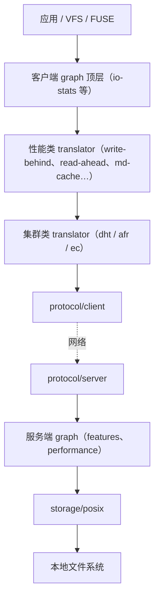
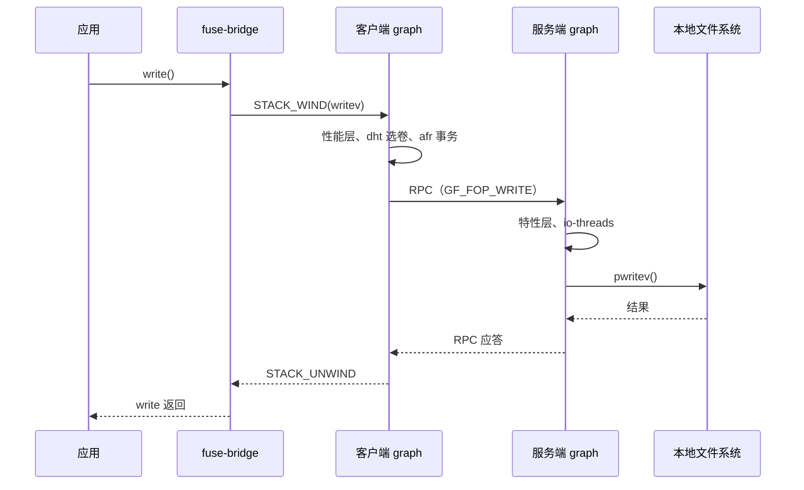

# 架构总览

GlusterFS 是一个无中心元数据服务的分布式文件系统：客户端进程加载一棵由 `volfile`
描述的 translator 树（graph），文件位置由客户端侧算法直接算出，数据请求从树的顶部逐层
向下传递到本地文件系统，应答再逐层返回。集群管理由每个节点上的 `glusterd` 负责，它
生成 volfile 并据此拉起、重配所有承载数据的进程。

本文说明系统由哪些部分组成、请求如何流动，以及各部分对应的代码入口。模块内部细节见
[模块索引](../modules/README.md)，请求传递机制的完整描述见
[调用栈与 FOP 模型](../core/call-stack-and-fop.md)。

## 目录

- 设计要点
- 进程模型
- xlator 树
- 一次写请求的完整路径
- 图的构建与激活
- 控制平面

## 设计要点

**一切能力都是 translator。** 协议、集群分布、性能优化、功能特性、本地存储全部以
translator 的形式实现，通过 volfile 组装成树。新增一种行为通常意味着新增或修改一个
translator，而不是在核心流程中插入分支。

**没有独立的元数据中心。** 目录与文件到子卷的映射由客户端侧算法决定；副本与纠删码的
组织由集群类 translator 决定。这消除了元数据服务器的单点与扩展瓶颈，代价是客户端
必须参与一致性维护。

**控制平面与数据平面分离。** `glusterd` 只负责配置、拓扑与进程生命周期；真正处理
文件 I/O 的是 brick 进程和各挂载点上的客户端进程。`glusterd` 退出不影响正在运行的
数据通路。

**同一个二进制承担多个角色。** `glusterfs`、`glusterfsd`、`glusterd` 是同一个可执行
文件，通过符号链接与 `argv[0]` 区分角色。

## 进程模型

| 进程 | 启动方式 | 职责 |
| --- | --- | --- |
| `glusterd` | 服务管理拉起，每节点一个 | 集群拓扑、卷配置、volfile 生成、进程生命周期、集群内事务 |
| brick 进程 | 由 `glusterd` 拉起，每个 brick 一个 | 服务端 graph，落盘到本地文件系统 |
| `glustershd` | 由 `glusterd` 拉起 | 副本与纠删码的自愈 |
| `quotad` | 由 `glusterd` 拉起 | 配额统计 |
| `bitd` | 由 `glusterd` 拉起 | 位衰减（bit-rot）扫描 |
| `scrubd` | 由 `glusterd` 拉起 | 位衰减校验与修复调度 |
| `snapd` | 由 `glusterd` 拉起 | 快照 |
| `gfproxyd` | 由 `glusterd` 拉起 | 为无客户端环境提供代理访问 |
| `glusterfs`（FUSE 挂载进程） | 用户通过 `mount` 或 `glusterfs` 命令启动 | 客户端 graph，经 FUSE 向内核提供文件系统 |
| 应用进程内客户端 | 应用链接 `libgfapi` | 不经过 FUSE，直接在进程内使用客户端 graph |

`glusterd` 保存状态的根目录由 `GLUSTERD_DEFAULT_WORKDIR` 定义
（`libglusterfs/src/glusterfs/glusterfs.h:284`，Linux 上为 `/var/lib/glusterd`），
管理套接字由 `DEFAULT_GLUSTERD_SOCKFILE` 定义
（`libglusterfs/src/glusterfs/glusterfs.h:306`）。

### 服务进程的统一拉起方式

除客户端进程外，所有服务进程都由 `glusterd_svc_start`
（`xlators/mgmt/glusterd/src/glusterd-svc-mgmt.c:144`）通过同一命令行模板拉起：

```text
<SBIN_DIR>/glusterfs -s <volfile-server> --volfile-id <id> -p <pidfile> -l <logfile> -S <sockpath>
```

每个服务拥有独立的 volfile、pidfile、日志与一条连回 `glusterd` 的 UNIX 域套接字
（`xlators/mgmt/glusterd/src/glusterd-svc-mgmt.c:201`）。服务实例在 conf 中以
`nfs_svc`、`bitd_svc`、`scrub_svc`、`quotad_svc` 等字段登记
（`xlators/mgmt/glusterd/src/glusterd.h:146`），自愈进程列表则单独记录在
`shd_procs`（`xlators/mgmt/glusterd/src/glusterd.h:154`）。构建入口在
`xlators/mgmt/glusterd/src/glusterd.c:1966`。

### 单二进制多角色

安装阶段把同一个可执行文件链接成三个名字
（`glusterfsd/src/Makefile.am:51`、`glusterfsd/src/Makefile.am:54`）。运行时的角色由
程序名决定：`gf_get_process_mode`（`glusterfsd/src/glusterfsd.c:1755`）比较 `argv[0]`
的 basename，分别得到服务端、管理端、客户端三种模式，取值定义在
（`libglusterfs/src/glusterfs/common-utils.h:102`）。函数 `main`
（`glusterfsd/src/glusterfsd.c:2846`）据此分支到不同的初始化路径。

## xlator 树

一个卷在一个进程内表现为一棵 translator 树。树由 volfile 描述，每个节点声明自己的
`type`、`name`、`option` 与 `subvolumes`。请求只能沿树向下（父到子）或向上
（子到父）流动，不能跨分支。



客户端与服务端是两棵独立的树，通过 RPC 连接。客户端树的自底向上方向终止于
`protocol/client`，服务端树的自顶向下方向起始于 `protocol/server`。

每个 translator 必须导出唯一的 `xlator_api` 符号，结构体
`xlator_api_t`（`libglusterfs/src/glusterfs/xlator.h:854`）描述它的初始化函数、回调与
能力表。节点的运行时状态保存在 `xlator_t`
（`libglusterfs/src/glusterfs/xlator.h:750`）中。详见
[xlator 框架](../core/xlator-framework.md)。

## 一次写请求的完整路径

以「两个副本的卷，应用执行一次 `write`」为例。请求向下逐层传递，应答沿同一路径反向
返回，每一层都可能修改数据、拆分请求、发往多个子节点或直接短路。



各段的代码入口：

| 阶段 | 位置 |
| --- | --- |
| FUSE 接收请求 | `xlators/mount/fuse/src/fuse-bridge.c:3128`（`fuse_write`） |
| 客户端发送 RPC | `xlators/protocol/client/src/client.c:885`（`client_writev`） |
| 客户端按协议版本分发 | `xlators/protocol/client/src/client-rpc-fops_v2.c:6013`（`[GF_FOP_WRITE]` 分派表） |
| 服务端接收 RPC | `xlators/protocol/server/src/server-rpc-fops_v2.c:4040`（`server4_0_writev`） |
| 服务端下发到子节点 | `xlators/protocol/server/src/server-rpc-fops_v2.c:3127`（`server4_writev_resume`） |
| 落盘 | `xlators/storage/posix/src/posix-inode-fd-ops.c:1987`（`posix_writev`） |

客户端侧的分发是间接的：`client_writev` 通过 `conf->fops->proctable[GF_FOP_WRITE]`
查表，`conf->fops` 在握手阶段按服务端支持的协议版本选定
（`xlators/protocol/client/src/client-handshake.c:852`，指向
`xlators/protocol/client/src/client-rpc-fops_v2.c:6059` 的 `clnt4_0_fop_prog`）。

## 图的构建与激活

volfile 由 `glusterfs_graph_construct`（`libglusterfs/src/graph.y:556`）解析成
`glusterfs_graph_t`，随后依次完成初始化与激活：

| 阶段 | 位置 |
| --- | --- |
| 解析 volfile 文本 | `libglusterfs/src/graph.y:556`（`glusterfs_graph_construct`） |
| 初始化各节点 | `libglusterfs/src/graph.c:456`（`glusterfs_graph_init`） |
| 生效并通知上下级 | `libglusterfs/src/graph.c:805`（`glusterfs_graph_activate`） |
| 仅改选项时的重配置 | `libglusterfs/src/graph.c:1143`（`glusterfs_graph_reconfigure`） |

volfile 的语法与生成逻辑见 [volfile 与图构建](../core/volfile-and-graph.md)。

## 控制平面

`gluster` 命令行工具（`cli/src/cli.c:745`）通过管理套接字与本地 `glusterd` 通信，由
本地 `glusterd` 再向集群内其他节点的 `glusterd` 发起 RPC。`glusterd` 暴露两组 RPC
程序：

| 监听方式 | 程序 | 位置 |
| --- | --- | --- |
| UNIX 域套接字 | CLI 程序、GETSPEC 程序 | `xlators/mgmt/glusterd/src/glusterd.c:85` |
| 网络 | peer、mgmt、mgmt v3、portmap、handshake 等 | `xlators/mgmt/glusterd/src/glusterd.c:76` |

客户端进程或挂载进程获取 volfile 走的是 GETSPEC 握手：请求方在
`glusterfsd/src/glusterfsd-mgmt.c:2532` 发起请求并由
`glusterfsd/src/glusterfsd-mgmt.c:2275`（`mgmt_getspec_cbk`）接收应答，
`glusterd` 侧由 `xlators/mgmt/glusterd/src/glusterd-handshake.c:867`
（`__server_getspec`）处理，分派表在
`xlators/mgmt/glusterd/src/glusterd-handshake.c:1789`。

## 相关文档

- [代码地图](code-map.md)
- [xlator 框架](../core/xlator-framework.md)
- [调用栈与 FOP 模型](../core/call-stack-and-fop.md)
- [volfile 与图构建](../core/volfile-and-graph.md)
- [RPC 与传输](../core/rpc-and-transport.md)
